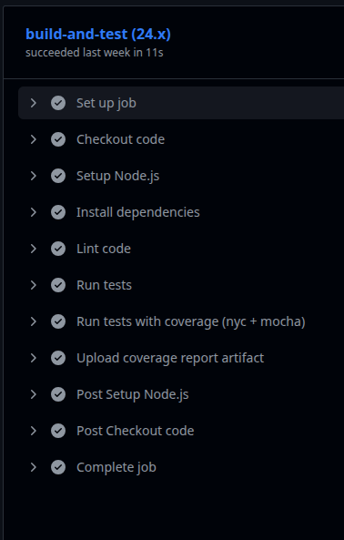
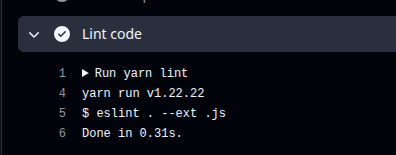
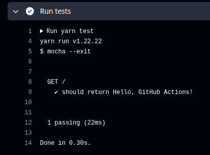
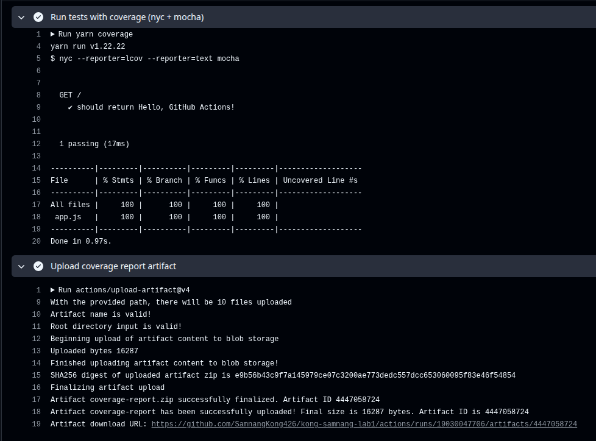
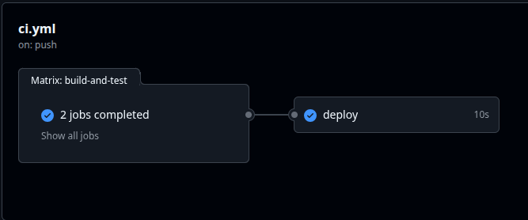

# VIII. Submission

## GitHub Repository: Submit your full Node.js project including .github/workflows/ci.yml and enhancements (code coverage, PR workflow, deployment)

https://github.com/SamnangKong426/kong-samnang-lab1.git

## Evidence of CI/CD: Screenshots or links showing workflow runs, linting, test results, code coverage, and deployment

### Workflows



### Linting



### Test Results



### Code Coverage



### Deployment



## Reflection: 200–300 words describing

### Challenges faced

I ran into problems because my computer was using Node.js v22, while GitHub Actions initially used v16 and v18. This caused some files, like .eslintrc.json, to only work with ESLint version 8. To fix it, I had to downgrade ESLint and change the workflow Node versions to v24 and v25, which were compatible with the packages I was using on v22.

### How you debugged workflow failures

I carefully read the error messages returned by GitHub Actions and debugged step by step. I identified the root causes and made adjustments until the workflow ran successfully without errors.

### Key learnings about CI/CD and GitHub Actions

I learned the importance of matching Node versions and package compatibility between local and CI environments. I also gained experience in structuring workflows, managing dependencies, and ensuring that linting, tests, and deployment run smoothly in an automated pipeline.

### Ideas for improvement

In the future, I could add notifications for workflow results, implement staging and production deployments, and improve test coverage reporting for better quality monitoring.

### Problems and Solutions

1. Since .eslintrc.json is not compatible with ESLint v9+, you need to use ESLint v8 instead:

```bash
yarn remove eslint
yarn add eslint@8 @eslint/eslintrc@2 --dev
```
