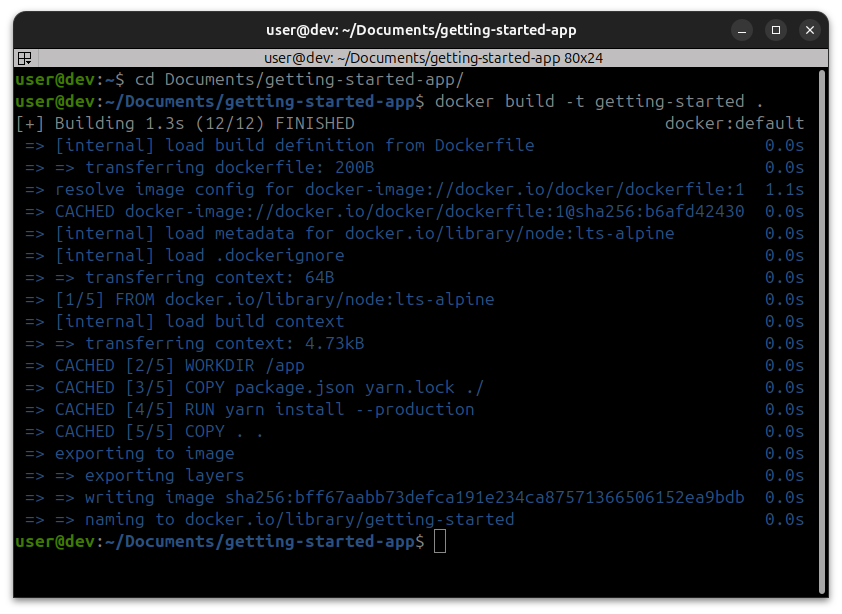
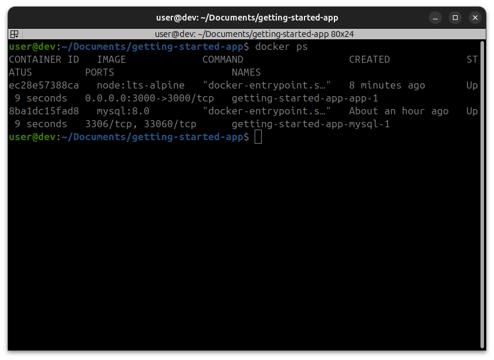
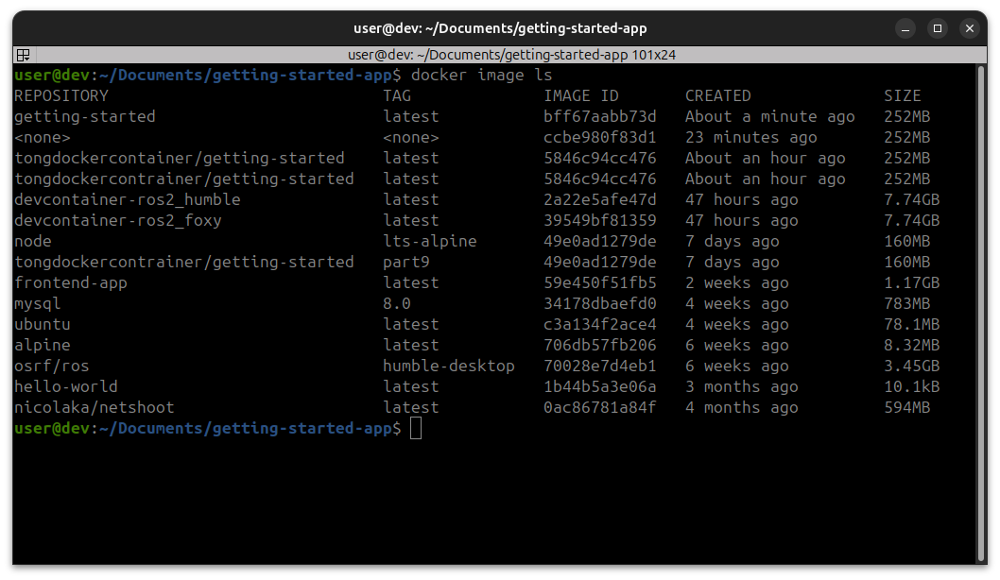
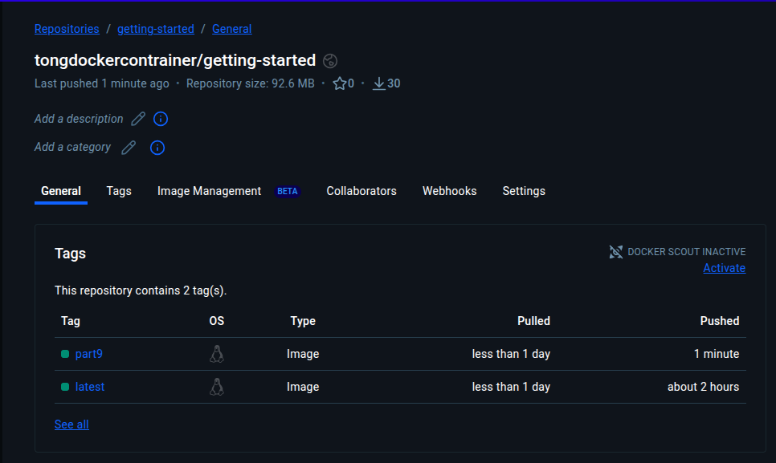
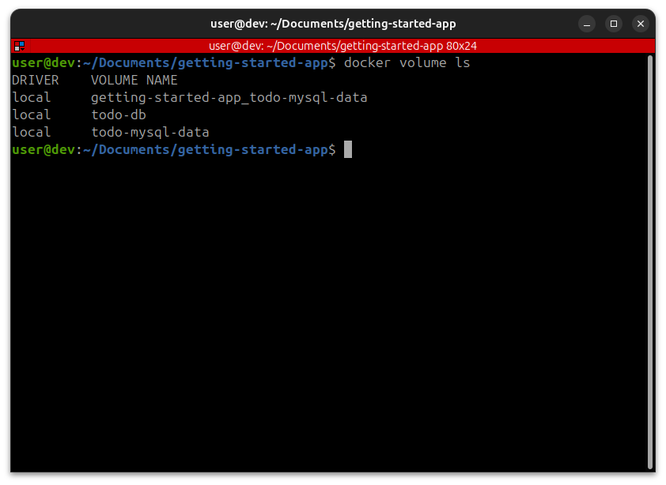
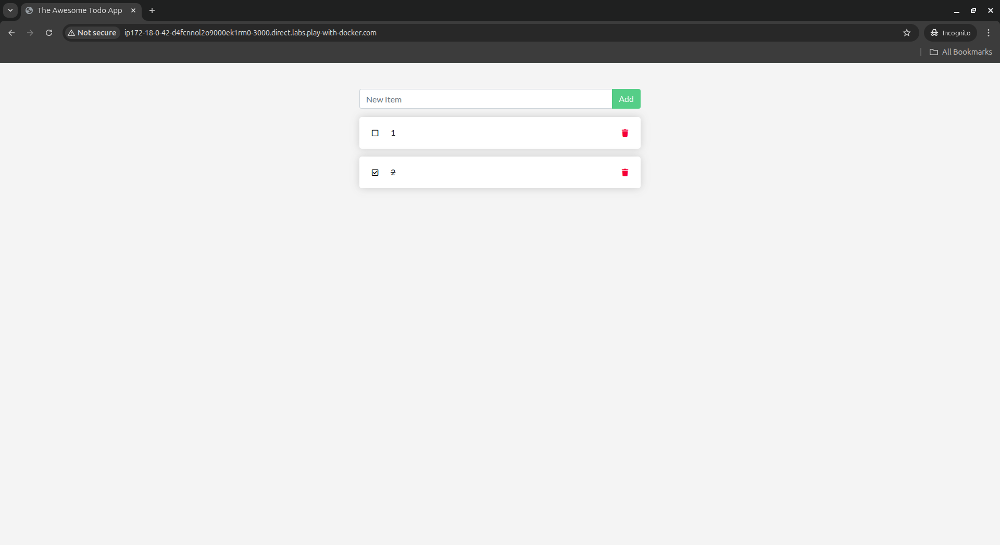

# 🐳 Lab 2: Docker

Student Name: Kong Samnang

GitHub Repository: [https://github.com/SamnangKong426/kong-samnang-lab1/tree/lab2-Docker](https://github.com/SamnangKong426/kong-samnang-lab1/tree/lab2-Docker)

-----

## Part 1: Containerize an Application

Dockerfile

```dockerfile
# syntax=docker/dockerfile:1

FROM node:lts-alpine
WORKDIR /app
COPY . .
RUN yarn install --production
CMD ["node", "src/index.js"]
EXPOSE 3000
```

Build and Run Commands

```bash
# Build the image
docker build -t getting-started .

# Start an app container
docker run -d -p 127.0.0.1:3000:3000 getting-started

# List all containers
docker ps
```




-----

## Part 2: Update the Application

```bash
# Build updated version of image
docker build -t getting-started .

# Stop container (Replace <the-container-id> with actual ID)
docker stop <the-container-id>

# Remove container (Replace <the-container-id> with actual ID)
docker rm <the-container-id>
```

-----

## Part 3: Share the Application

```bash
# List all images
docker image ls

# Rename docker image using tag command (Replace YOUR-USER-NAME)
docker tag getting-started YOUR-USER-NAME/getting-started

# Build image based on specific OS (Replace YOUR-USER-NAME)
docker build --platform linux/amd64 -t YOUR-USER-NAME/getting-started .

# Push the image (Replace YOUR-USER-NAME)
docker push YOUR-USER-NAME/getting-started 
```





-----

## Part 4: Persist the DB (Using Volumes)

```bash
# Create a volume
docker volume create todo-db

# Run container using a volume mount
docker run -dp 127.0.0.1:3000:3000 --mount type=volume,src=todo-db,target=/etc/todos getting-started

# Inspect a created volume
docker volume inspect todo-db
```




-----

## Part 5: Use Bind Mounts (Local Development)

```bash
# Example: Run ubuntu container using bind mount to current working directory
docker run -it --mount type=bind,src="$(pwd)",target=/src ubuntu bash

# Run development container with bind mount and live reload
docker run -dp 127.0.0.1:3000:3000 \
    -w /app --mount type=bind,src="$(pwd)",target=/app \
    node:lts-alpine \
    sh -c "yarn install && yarn run dev"

# Watch the logs (Replace <container-id> with actual ID)
docker logs -f <container-id>
```

-----

## Part 6: Multi-container Apps

```bash
# Create a network
docker network create todo-app

# MySQL container attach to the created network
docker run -d \
    --network todo-app --network-alias mysql \
    -v todo-mysql-data:/var/lib/mysql \
    -e MYSQL_ROOT_PASSWORD=secret \
    -e MYSQL_DATABASE=todos \
    mysql:8.0

# Use exec to use bash terminal (Replace <mysql-container-id> with actual ID)
docker exec -it <mysql-container-id> mysql -u root -p
```

-----

## Part 7: Use Docker Compose

compose.yaml

```yaml
services:
  app:
    image: node:lts-alpine
    command: sh -c "yarn install && yarn run dev"
    ports:
      - 127.0.0.1:3000:3000
    working_dir: /app
    volumes:
      - ./:/app
    environment:
      MYSQL_HOST: mysql
      MYSQL_USER: root
      MYSQL_PASSWORD: secret
      MYSQL_DB: todos

  mysql:
    image: mysql:8.0
    volumes:
      - todo-mysql-data:/var/lib/mysql
    environment:
      MYSQL_ROOT_PASSWORD: secret
      MYSQL_DATABASE: todos

volumes:
  todo-mysql-data:
```

Run Command

```bash
# Run the application with just one command
docker compose up -d
```

-----

## Part 8: Image-building Best Practices

```bash
# Monitor image history
docker image history getting-started

# Use --no-trunc to get full output
docker image history --no-trunc getting-started
```

Key Optimization Principle: Optimize the layer caching by copying `package.json` and installing dependencies *before* copying all application code, and utilizing multi-stage builds (`--from=build`) to separate build-time and runtime environments for a smaller final image.

-----

## Part 9: What Next

- Learn about Container orchestration (e.g., Kubernetes).
- Explore Cloud Native Computing Foundation (CNCF) projects.
- Create a container from scratch.

